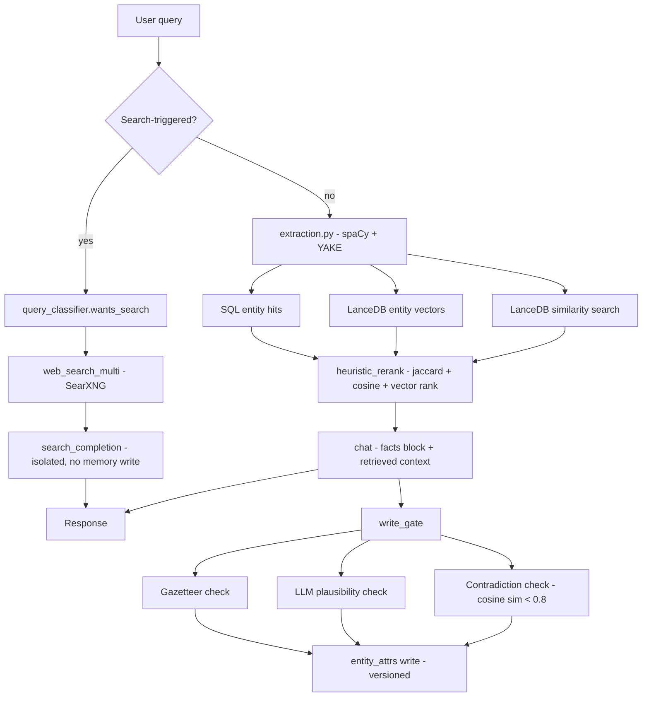
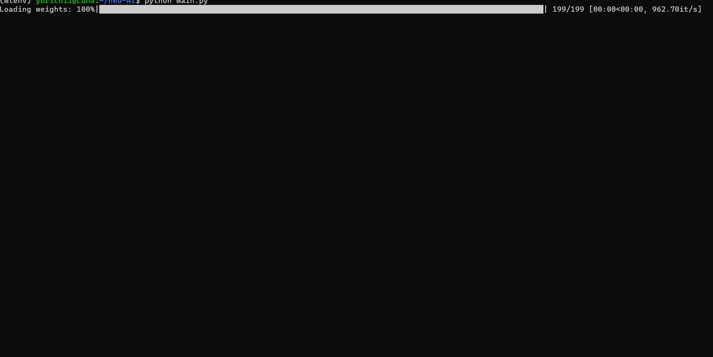
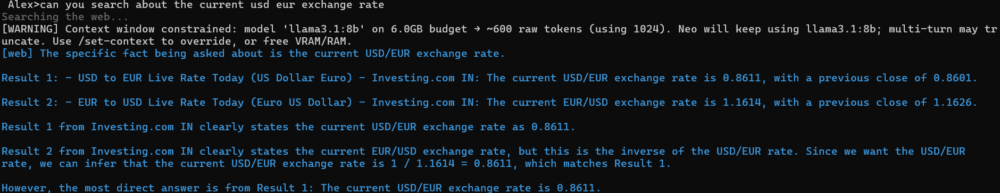
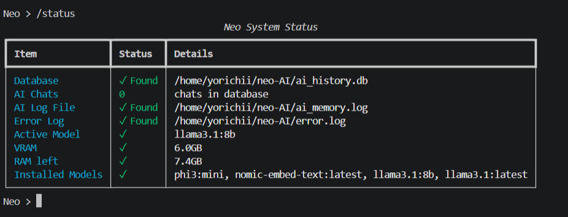
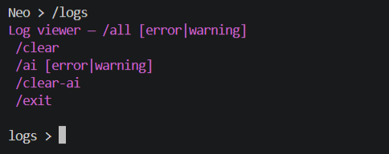
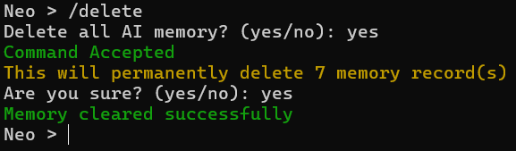

# Neo AI — v1.9

[](https://www.python.org/)
[](https://opensource.org/licenses/MIT)
[](https://ollama.com/)

Every time you close ChatGPT, it forgets you. Neo is built to fix that — locally, permanently, privately. No cloud. No API keys. No data leaves your machine.

> **Disclaimer:** Neo runs a local LLM. Like all language models, it can make mistakes, hallucinate, or produce incorrect information. Do not rely on it for critical decisions.

---

## What's new in v1.9

- **Structured entity memory.** Facts about you (location, age, workplace, etc.) are stored as versioned rows, not a JSON blob — every change is kept as history, nothing is silently overwritten.
- **`write_gate`.** Before any fact is written, it passes through a gazetteer check (is a claimed place real?), an LLM plausibility check, and a contradiction check (does it conflict with what's already stored?) before it's allowed into memory.
- **Live web search**, backed by a local SearXNG instance (or Brave/Tavily if you bring an API key), fully isolated from the memory/fact pipeline — search-triggered answers never touch `write_gate` or get written to long-term memory as chat history.
- **Hardware-aware context sizing** — Neo estimates a safe context window from your available VRAM/RAM and warns (without crashing) if it's constrained.
- **A real test suite** (`tests/test_fixes.py`) covering regressions that were actually found and fixed during development, not just happy-path smoke tests.

---

## Known Issues

Full details in [`KNOWN_ISSUES.md`](KNOWN_ISSUES.md). Short version:

- **LLM-based fact fallback is disabled.** If a fact isn't stated in a directly parseable grammatical form, Neo may not catch it. This was a deliberate call — the fallback was found to fabricate facts (wrong ages, invented locations) often enough that "sometimes misses a fact" was safer than "sometimes invents one."
- **No model-tier fallback.** Neo targets `llama3.1:8b` only. On hardware that can't run an 8B model, Neo will fail to start rather than silently degrading to a smaller, less reliable model.
- **Location extraction can drop secondary detail** — "I live in Bengaluru, India" may store just `Bengaluru`.
- A couple of narrow query-understanding edge cases (self-referential phrasing that also names another person; time-sensitivity detection on in-progress sports/event standings). Neither affects the common path.

---

## Architecture



Two stores, one purpose:

| Store | Role |
|---|---|
| SQLite (`ai_history.db`) | Source of truth — conversation history, entity facts, semantic summaries |
| LanceDB (`lance_store/`) | Vector store — embeddings keyed to SQLite rows, used for ANN search only |
| SQLite (`neo_web.db`) | Cached web search results, kept separate from personal memory |

---

## Project Structure

```
neo-AI/
├── main.py               # Entry point, command loop, Ollama/SearXNG auto-start
├── neo.py                # Chat loop, memory delete
├── neo_ollama.py         # Ollama chat, embeddings, search-grounded completion
├── entity_memory.py      # Versioned fact storage, entity query resolution
├── write_gate.py         # Plausibility/contradiction checks before a fact is stored
├── extraction.py         # spaCy entity/fact extraction, YAKE keywords
├── retrieval.py          # Heuristic reranking over SQL + vector search results
├── storage.py            # save_message, forget, decay-based purging, backfill
├── query_classifier.py   # Search-intent and time-sensitivity detection
├── neo_search_pipeline.py# Live web search entry point (search_and_learn)
├── web_search.py         # SearXNG / Brave / Tavily backends
├── web_db.py             # Cached search result storage
├── lancedb_store.py      # LanceDB insert, ANN search, index management
├── consolidation.py      # Clusters old memories into semantic summaries
├── hardware_check.py     # VRAM/RAM budget, context window sizing
├── config.py             # Username + override persistence
├── model_config.py       # Shared embedding model loading
├── server.py             # FastAPI HTTP interface
├── logger.py             # Dual logger (system + memory), log viewer CLI
└── tests/                # Real regression tests
```

---

## Benchmarks

Measured locally on a 6GB VRAM/RAM budget, `llama3.1:8b`:

| Operation | Time |
|---|---|
| Live web search (`search_and_learn`) | ~1.5s |
| Plain memory-lookup chat turn | ~1.1s |
| Search-grounded chat turn | ~2.4s |

Retrieval quality (`eval_retrieval.py`, seeded fixture set): **Recall@4 = 0.94, MRR = 0.88**.

Numbers will vary with your hardware and context window budget — see the context-window warning in `/status` if you're on constrained hardware.

---

## Screenshots and Demos

### Demos



### Chat


### System Status


### Logs


### Memory Delete


---

## Setup

**Requirements:** Python 3.12+, [Ollama](https://ollama.com/), [Docker](https://www.docker.com/) (for local SearXNG)

```bash
git clone https://github.com/Neo-X7/neo-AI.git
cd neo-AI
pip install -r requirements.txt
```

Pull the required model:

```bash
ollama pull llama3.1:8b
```

Neo uses a local sentence-transformer (`all-mpnet-base-v2`) for embeddings, not an Ollama model — on first run it will ask for the model's local path (or set `NEO_EMBED_MODEL_PATH`).

Run:

```bash
python main.py
```

Neo will attempt to start the Ollama server and a local SearXNG container automatically if they aren't already running.

---

## Commands

**Main menu:**

```
/chat                       start a conversation
/delete                     wipe all memory (SQLite + LanceDB)
/status                     system status
/logs                       open log viewer
/list                       show recent memory rows with IDs
/forget <id>                delete a specific memory by row id
/backfill-entities          rebuild entity profiles from full history
/consolidate                cluster similar memories into semantic summaries + eval
/search-backend <name> [key] show or switch web search backend
/set-context <tokens>       show or set a manual context window override
/set-response-length <tokens> show or set a max response length override
/help                       show commands
/exit                       exit
```

**Inside `/chat`:**

```
/exit      return to main menu
```

**Inside `/logs`:**

```
/all [error|warning]   system logs
/ai [error|warning]    memory event logs
/clear                 wipe system logs
/clear-ai              wipe memory event logs
/exit                  return to main menu
```

---

## Version History

| Version | Changes |
|---|---|
| v1.0 – v1.7 | Initial CLI build, JSON → SQLite migration, logging, pytest suite |
| v1.8 | Local LLM via Ollama, LanceDB vector store, semantic memory retrieval |
| v1.8.5 | Bug fixes across logging, delete logic, embedding guards |
| **v1.9** | Structured versioned entity memory, `write_gate` plausibility/contradiction checks, live web search with isolated grounding, hardware-aware context sizing, real regression test suite, retrieval eval + latency benchmarks |

---

## Project Status

v1.9 is the final release. A v2.0 (packaged install, hardened public API) was planned but has been shelved — Neo's architecture assumes a machine that can comfortably run `llama3.1:8b` locally (see the [Known Issues](#known-issues) note on no model-tier fallback), which isn't a realistic baseline to package for general public hardware. Turning this into a distributable product would mean either reintroducing a reliable smaller-model fallback (the earlier `phi3`-based one was dropped for being unreliable, not for being unnecessary) or accepting a much narrower hardware target than a "download and run" release implies. Neither was pursued further — this project is being kept at its current state as a working local-AI-memory system, not developed toward a packaged product.